# GitHub Projects 完整教學

> 本文介紹的是新版 **Projects(ProjectsV2)**,而非舊版 Projects Classic。
> Projects 是一個「可跨 repo 的規劃工具」,把 **Issue / Pull Request** 整合在一起,用來做 backlog 管理、衝刺規劃(sprint)、產品藍圖等。可在「使用者層級(個人)」或「組織層級(團隊)」建立。

> 📷 本文所有截圖皆來自實際操作:以 `issue_tmp` repo 的 issues 建立的範例專案 **「Penance Manager 範例」**,你可以跟著每一步操作一次。

這份教學把官方文件與實務細節整理在一起,適合第一次接觸 Projects 的人從頭讀:

- Project 核心觀念與「一個 Project,三種視圖」
- 所有欄位:內建欄位 + 五種自訂欄位(Text / Number / Date / Single select / Iteration)
- 三種版面:Table / Board / Roadmap 的完整用法與設定
- 建立 Project、把項目加進來的各種方式
- 自動化(內建 workflow / GitHub Actions / API)、Insights 圖表、Project 層級設定
- 權限協作、`gh` CLI 操作、給 PM 的實務建議

---

## 一、核心觀念:一個 Project = 三種視圖共用一份資料

新版 Projects 的核心設計精神是:

> **同一個 Project = 一份資料表,可以用三種版面(Layout)來呈現。**

你建立一個 Project 之後,可以在裡面切換三種視圖:

- **Table(表格)** — 像試算表,一列一個 item
- **Board(看板)** — 可拖拉卡片
- **Roadmap(時間軸)** — 視覺化排程

同一個 item(例如某個 issue)會在三種視圖裡同時存在,只是呈現角度不同。你可以針對各視圖個別設定篩選、分組、排序、要顯示哪些欄位,但這些設定**只影響當前視圖,不會動到其他視圖**。

換句話說:**資料只有一份,view 只是不同的看法。** 改一個 item 的欄位值,所有 view 同步更新;但「怎麼排、怎麼篩、看哪些欄」則是每個 view 各自決定。

---

## 二、Project 裡的「元素」

Project 由三種東西組成:**Items(項目)**、**Fields(欄位)**、**Views(視圖)**。

### 1. Items(項目)

Item 就是 Project 裡的每一筆資料,只能在 Project 裡建立,類型有三種:

- **Issue** — 從 repo 拉進來的 issue
- **Pull Request** — 從 repo 拉進來的 PR
- **Draft issue(草稿)** — 直接在 Project 內建立的草稿項目,有標題、內文與 metadata,之後可一鍵轉成正式 issue

> 💡 Draft issue 很適合「先把點子丟進 backlog」—— 還沒想清楚要進哪個 repo 也沒關係,先記下來,稍後再轉成正式 issue。

在任一視圖點擊 item 標題,右側會滑出**詳情面板**,可直接檢視 issue 內容、修改 Status、Assignees、Labels 等所有欄位。面板中的 **Projects** 區塊會展開這個 item 在本 Project 的所有欄位值(Status、Priority、Start date、Target date…),可在此一次改完:

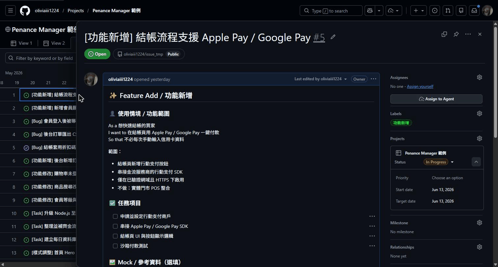
*點開 item 後的右側詳情面板,Projects 區塊展開了 Status、Priority、Start/Target date,可直接修改*

### 2. Fields(欄位)

每一個 item 都可以掛各種欄位(metadata),分兩類:

- **內建欄位** — 系統內建、欄位類型不可刪除,如 Title、Assignees、Status、Labels、Milestone、Repository、Issue Type 等。
- **自訂欄位** — 你自己建立的欄位,共五種:**Text(文字)**、**Number(數字)**、**Date(日期)**、**Single select(單選)**、**Iteration(疊代)**。

每個自訂欄位都會在三種視圖中出現,且每個 Project 都可以定義自己的一套自訂欄位。(完整列表見[第三節](#三欄位fields完整列表)。)

### 3. Views(視圖)

Views 就是 Table、Board、Roadmap 這三種版面。

- 每個視圖都可獨立套用 **篩選(filter)、排序(sort)、分組(group)、切片(slice)、欄位顯示/隱藏** 等設定。
- 你可以建立**多個**視圖,例如「Bug Board」「Feature Table」「Frontend Roadmap」並排放。
- 新建立的 Project 會自動帶有預設視圖(通常是一個 Table view)。
- 所有視圖**共用同一份資料(Items)**;對某個視圖做的設定,只影響該視圖。

---

## 三、欄位(Fields)完整列表

### A. 內建欄位(系統提供,無法刪除類型)

| 欄位 | 說明 |
| :--- | :--- |
| `Title` | 標題 |
| `Assignees` | 指派人(可多人) |
| `Status` | 狀態(內建 single select,且是 Board 的預設分欄欄位) |
| `Labels` | 標籤(可多個) |
| `Milestone` | 里程碑 |
| `Repository` | 所屬 repo |
| `Issue Type` | issue 類型 |
| `Parent issue` | 父 issue |
| `Sub-issue progress` | 子 issue 進度 |
| `Linked pull requests` | 關聯的 PR |
| `Reviewers` | PR 的審查者 |

**怎麼修改某個 item 的 Status?** 最快的方式是在 Table 視圖直接點該列的 Status 儲存格,從下拉選單挑選;Board 視圖則是直接把卡片拖到別欄。

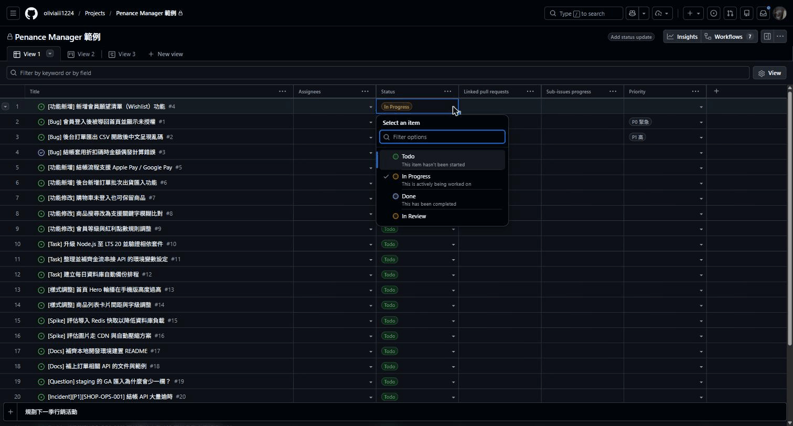
*在 Table 中點 Status 儲存格即可切換狀態(圖中可看到自訂的「In Review」選項)*

**怎麼新增/修改 Status 的選項?** Status 本身是一個 single select 欄位,選項可自由增改:

1. 進入 Project 右上 **⋯ → Settings**
2. 左側 **Custom fields** 區點 **Status**
3. 在 **Options** 區塊可拖拉排序、點 **⋯** 重新命名/改顏色/刪除,或在底部 **Add option...** 輸入新選項(例如 `In Review`)後按 **Add**

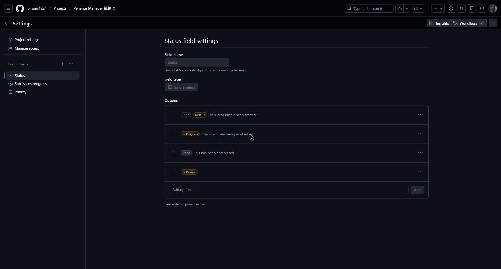
*Status field settings:這裡新增了「In Review」選項,新選項會立即出現在所有視圖*

> **關於 Issue Type**
>
> - 在**組織層級**可自訂 issue types:內建有 Bug、Feature、Task,可再新增自訂類型。
> - 這是一個「單選」概念,每個 issue 只能有一個 type。
>
> **關於 Organization-level fields(組織層級欄位)**
>
> - 組織可定義統一的結構化欄位(像 priority、effort、dates),套用到組織內各 Project,確保全公司欄位定義一致。這跟 repo 自己的自訂欄位不同,是更上層的共用欄位。

### B. 自訂欄位類型(共五種)

**怎麼新增自訂欄位?** 在 Table 視圖最右側點 **+** → **New field**,輸入名稱、選擇類型即可。這個 **+** 選單同時也是控制欄位顯示/隱藏的地方:

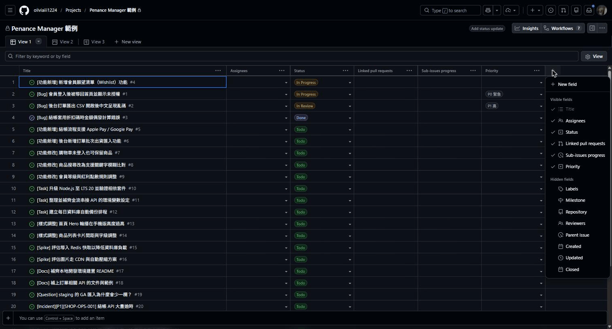
*Table 右上 + 選單:New field 與 Visible/Hidden fields 切換*

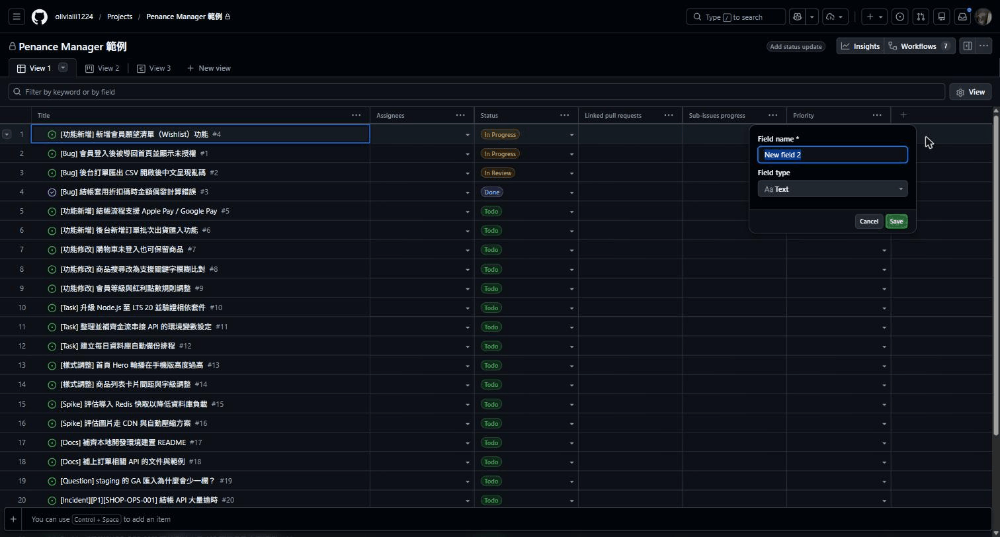
*輸入欄位名稱後選擇 Field type*

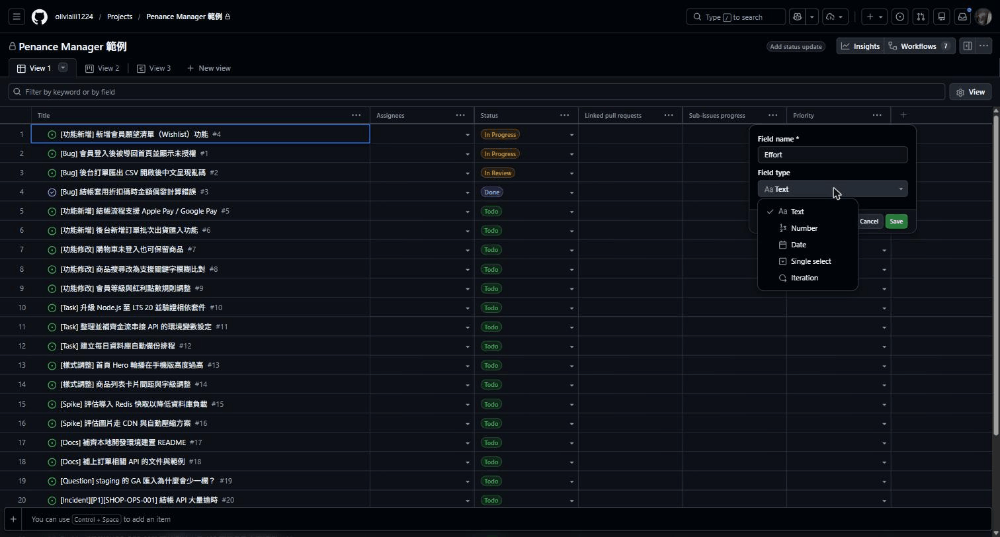
*五種自訂欄位類型:Text / Number / Date / Single select / Iteration*

> 💡 選 **Single select** 時會多出 Options 區塊,可逐一加入選項(例如 `P0 緊急`、`P1 高`、`P2 一般` 的 Priority 欄位)。

| 類型 | 說明 | 篩選語法範例 |
| :--- | :--- | :--- |
| **Text** | 自由文字、備註 | `field:"exact text"` |
| **Number** | 數字,如工時、複雜度 | `field:>=10`、`field:10..20`(範圍) |
| **Date** | 用打字或日曆挑日期 | 可用於篩選與排序 |
| **Single select** | 單選下拉,每個選項可設顏色與描述 | `field:option`、`field:option1,option2`(多值) |
| **Iteration** | 疊代,規劃 sprint / 週期,自動帶日期範圍 | `field:@current`、`@next`、`@previous` |

**Single select 的幾點注意**

- 最多可有 **50 個選項**,每個選項可設顏色與描述,顏色會顯示在看板卡片的標籤上。
- 可設**預設值**,新項目自動帶入。
- 單選就是單選 —— 若你需要一個項目同時掛多個標籤,改用內建的 `Labels`,或另開一個用途不同的欄位。

**Iteration 欄位的用法與語法**

Iteration 是「週期 / 區間」欄位,專門用來規劃 sprint 或其他開發週期。每個疊代可設定:

- **Start(開始日)** 與 **長度**(天 / 週)—— 系統會自動算出結束日
- **Break(中斷)** —— 代表休假或非開發週,會被自動排除在疊代之外

它有內建的自動化語法,**會隨時間自動更新指向**,不用每週手動改:

- `@current` —— 自動指向「今天落在的疊代」
- `@next` —— 下一個疊代
- `@previous` —— 上一個疊代

> ⚠️ Iteration 只能在 **Project 層級**建立,無法當成獨立的 repo / 組織層級 Issue 自訂欄位來用。

---

## 四、三種視圖(Layout)完整用法

要新增視圖,點視圖分頁列的 **+ New view**,選擇 Layout(Table / Board / Roadmap),也可以 **Duplicate view** 複製現有視圖再調整:

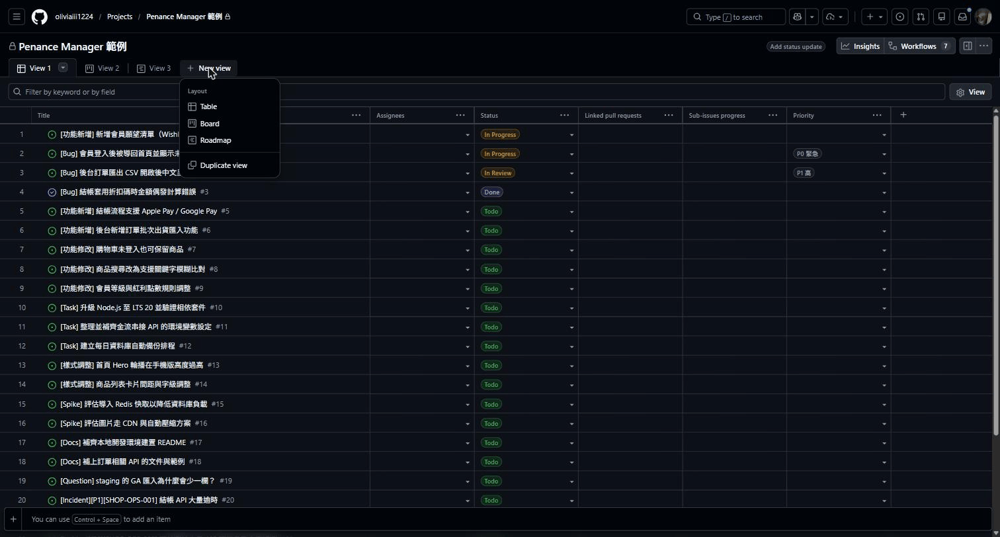
*+ New view 選單:選擇要新增的 Layout*

### 1. Table(表格)

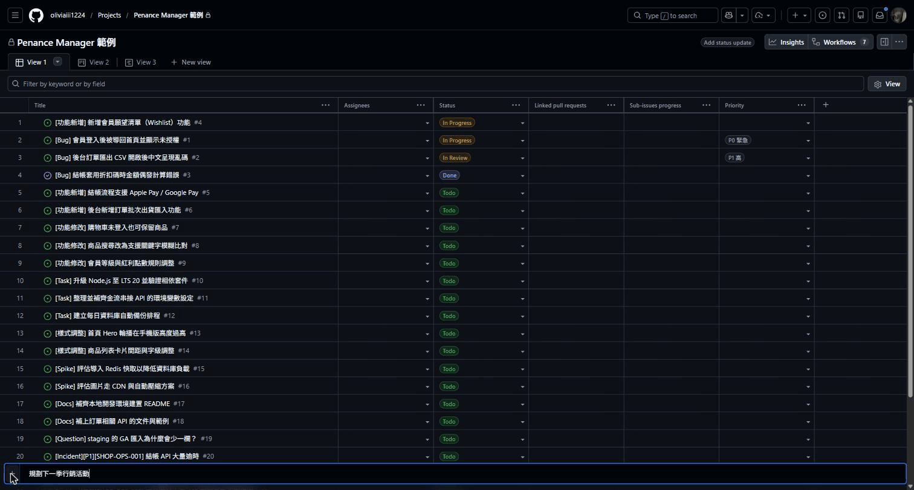
*Table 視圖:一列一個 item,可看到 Status 與自訂的 Priority 欄位*

- **長什麼樣子**
  - 一列一個項目,欄位名稱是欄標頭,類似試算表,可一次看到所有欄位。
- **適合用在**
  - 瀏覽大量項目、當作 backlog 或清單、批次編輯。
- **核心功能與設定**
  - **顯示/隱藏欄位(Show/hide fields)**:自訂這個 view 要顯示哪些欄位。
  - **排序(Sort)**:可指定欄位升冪 / 降冪,table 還能加**次要排序**。
  - **分組(Group)**:依某欄位把項目分成一段一段(例如依 Status 分組)。
  - **篩選(Filter)**:用查詢語法只顯示符合的項目(語法見[第六節](#六篩選語法filter))。
  - **欄位 / 列重新排序**:直接拖拉欄頭或某一列調整順序。
  - **Field sum(欄位加總)**:對數字欄位顯示總和或項目數;啟用分組後會顯示在每組標頭。

### 2. Board(看板 / Kanban)

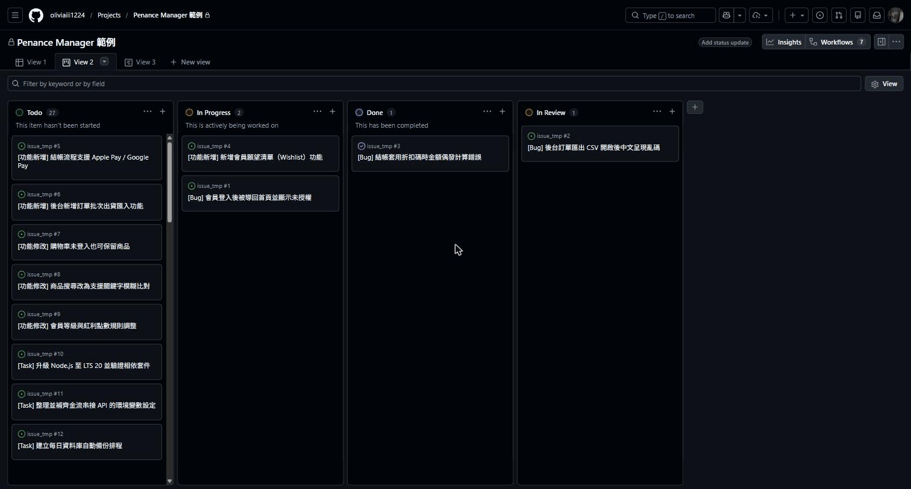
*Board 視圖:依 Status 分欄(Todo / In Progress / Done / In Review)*

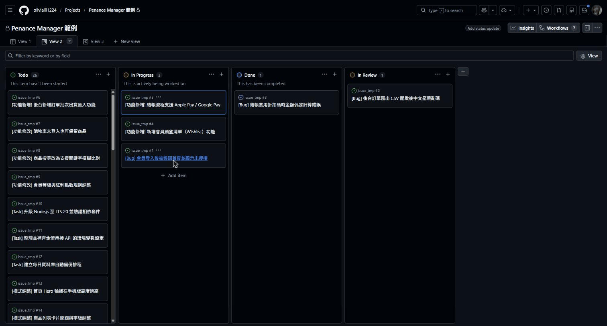
*把卡片從 Todo 拖到 In Progress 後,該 item 的 Status 自動變更,欄頂計數同步更新*

- **長什麼樣子**
  - 把項目排成一張張可拖拉的卡片,分在不同直欄裡。
- **適合用在**
  - 追蹤工作流動狀態(Todo → In Progress → Done)。
- **核心功能與設定**
  - **Column field(直欄欄位)**:預設用 `Status` 當直欄,但可改用**任何 single select 或 iteration 欄位**。
  - **拖拉即改值**:把卡片拖到別欄,該項目對應的欄位值會**自動跟著改**(例如拖到 Done,Status 就變 Done)。
  - **Column limit(卡片數上限)**:可為單一直欄設上限,**僅作提示、不強制**,用來提醒某欄塞太多。
  - **水平分組(Group)**:除了直欄,還能再依另一個欄位做橫向分組。
  - **Field sum**:顯示在每個直欄頂端,方便看每欄負載。

> ⚠️ Board 一旦套用排序,欄內就**不能再手動拖拉重排**,但仍可跨欄移動卡片。

### 3. Roadmap(藍圖 / 時間軸)

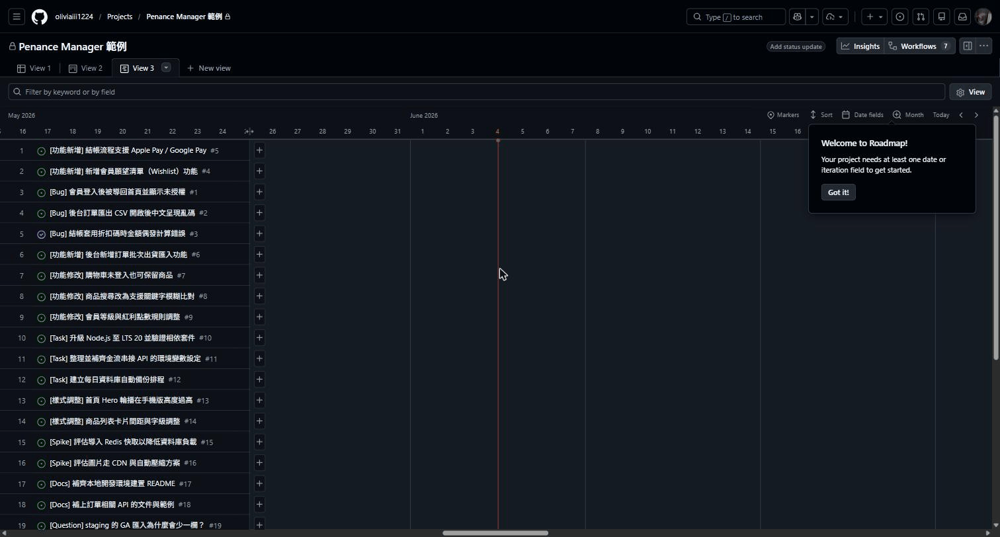
*Roadmap 視圖:剛建立時會提示「需要至少一個 date 或 iteration 欄位」才能在時間軸上排項目*

- **長什麼樣子**
  - 把項目擺在一條時間軸上,做高階的時程視覺化。
- **適合用在**
  - 產品藍圖、跨期規劃、對 stakeholder 報告整體進度。
- **核心功能與設定**
  - **用日期 / iteration 欄位定位**:項目在時間軸上的落點,由你選的**日期欄位**或 **iteration 欄位**決定。
  - **拖拉即改期**:直接拖項目就能改它的起訖日或所屬疊代。
  - **時間軸標線(Markers)**:可顯示垂直標線標出關鍵日期(疊代、里程碑、項目日期)。
  - **時間跨度**:可切換以週 / 月 / 季 等不同尺度檢視。

#### Roadmap 設定步驟(完整示範)

Roadmap 剛建立時是空的,因為它不知道要用哪個欄位來定位項目。照以下步驟設定:

**1. 點右上 `Date fields`(日期欄位)** —— 這裡決定時間軸用哪兩個欄位當「開始」與「結束」。一個全新的 Project 還沒有日期欄位,所以兩邊都是 No start date / No target date:

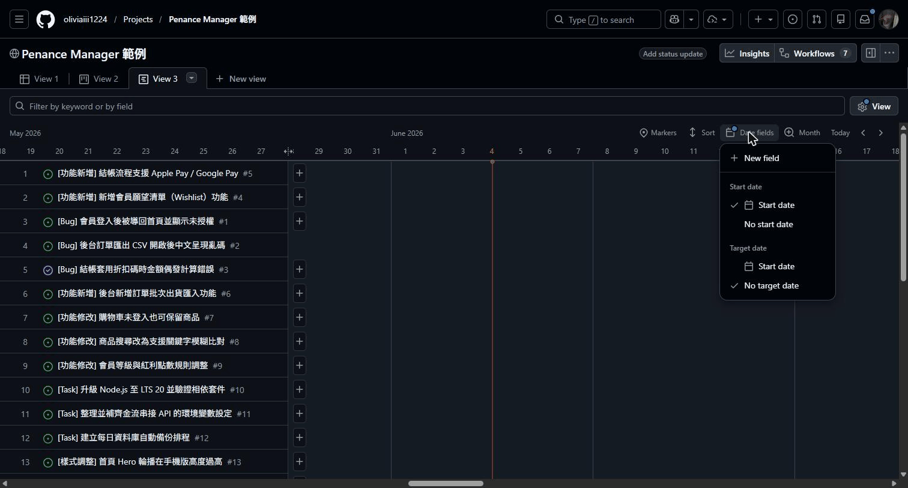
*右上 Date fields 選單,可分別指定 Start date 與 Target date 欄位*

**2. 點選單裡的 `+ New field` 建立日期欄位** —— Field type 選 **Date**,先建一個 `Start date`,再重複一次建 `Target date`:

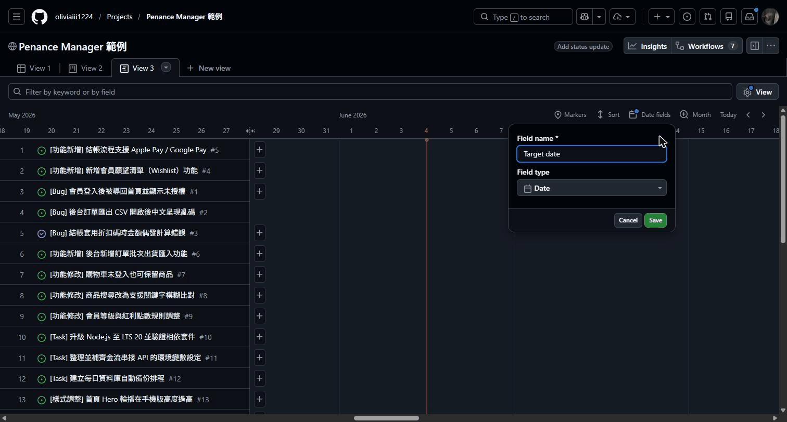
*建立 Date 類型的欄位(這裡建 Target date);建好後 GitHub 會自動把它指派為對應的日期欄位*

> 💡 建好兩個日期欄位後,回到 Date fields 選單會看到 Start date 區與 Target date 區各自打勾,Roadmap 就啟用了。

**3. 在時間軸上排程** —— 有了日期欄位後,把游標移到某列的時間軸區域會出現 **+**,點一下就在那天建立排程點;也可以直接**拖拉**長條兩端調整起訖、或整條左右拖移改期。另一個更精確的方式是**點開 item 詳情面板**,直接在 Start date / Target date 欄位用日曆挑日期(見下圖)。

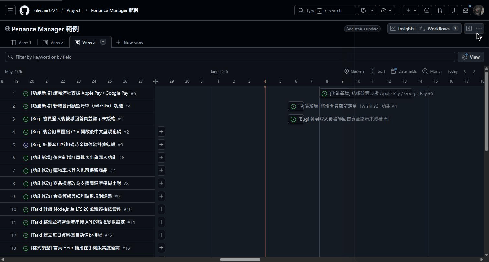
*排程後的 Roadmap:#5 有一段橫跨數日的長條(Start→Target),#4、#1 則是單日點*

> ⚠️ 若只填 Start date 沒填 Target date,項目在時間軸上會是單一個點;兩個日期都填才會畫成有長度的長條。Iteration 欄位也可當定位依據,適合用 sprint 週期來排。

---

## 五、各視圖的設定選項對照

不同設定在不同 layout 的支援程度不一樣,整理成一張對照表:

| 設定 | 作用 | Table | Board | Roadmap |
|:---|:---|:---:|:---:|:---:|
| **Filter(篩選)** | 用查詢語法只顯示符合的項目 | ✅ | ✅ | ✅ |
| **Sort(排序)** | 依欄位值排序,table 可加次要排序 | ✅ | ✅* | ✅ |
| **Group(分組)** | 依欄位把項目分成區塊;board 可水平分組 | ✅ | ✅ | ✅ |
| **Slice(切片)** | 側邊面板列出某欄位的值,點一下就過濾該值 | ✅ | ✅ | ✅ |
| **Field sum(欄位加總)** | 顯示數字欄位的總和或項目數量 | ✅ | ✅ | ✅ |
| **Show/hide fields** | 控制哪些欄位出現 | ✅ | — | — |
| **Column field(直欄欄位)** | 設定看板用哪個欄位當直欄 | — | ✅ | — |
| **Column limit(卡片數上限)** | 單一直欄的卡片數上限(僅提示) | — | ✅ | — |
| **欄位 / 列重新排序** | 拖拉調整欄位或列順序 | ✅ | — | — |
| **時間軸標線 / 區間** | roadmap 上的關鍵日期標線、時間跨度 | — | — | ✅ |

> *Board 排序後,欄內就不能手動拖拉重排,但仍可跨欄移動。
> Slice 不能用 `title`、`reviewers`、`linked PR` 來切。
> Field sum 在 board 顯示在每欄頂端;table / roadmap 啟用分組後顯示在每組標頭。

---

## 六、篩選語法(Filter)

在任一 view 上方的篩選列輸入查詢語法,即可只顯示符合的項目。

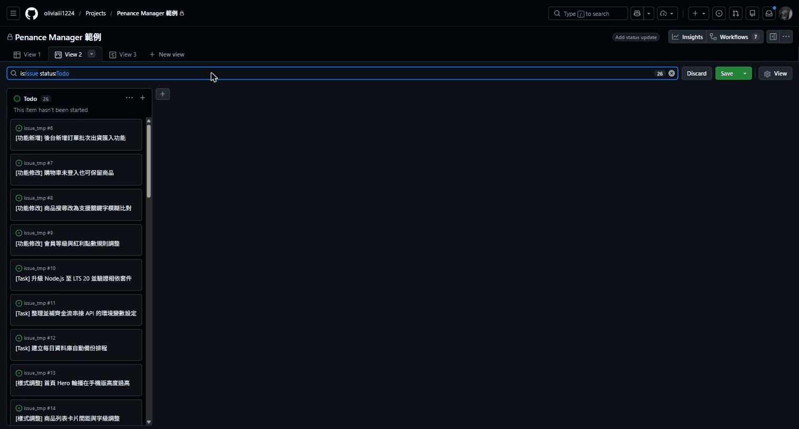
*在 Board 輸入 `is:issue status:Todo` 後只剩 Todo 欄;右上可 Save 存進視圖或 Discard 捨棄*

記住兩個規則就能組合出大部分查詢:

- **多個條件用空白分隔 = AND**(同時成立)
- **同一欄位用逗號分隔 = OR**(其中之一)
- **前面加 `-` = 排除**

常用範例:

| 語法 | 作用 |
| :--- | :--- |
| `status:Todo` | 篩選單選欄位的值 |
| `label:bug,urgent` | 多值(逗號 = OR) |
| `assignee:@me` | 指派給自己 |
| `iteration:@current` | 目前疊代(隨時間自動更新) |
| `no:assignee` | 沒有指派人 |
| `is:open` / `is:closed` | 依開關狀態 |
| `is:issue` / `is:pr` | 依項目類型 |
| `effort:>=5` | 數字欄位比較 |
| `effort:5..15` | 數字欄位範圍 |
| `-label:wontfix` | 排除某標籤 |

---

## 七、建立 Project 與加入項目

### 1. 建立 Project

- **個人 Project**:到你的 GitHub 個人頁 → **Projects** 分頁 → **New project**。
- **組織 Project**:到組織頁 → **Projects** 分頁 → **New project**。

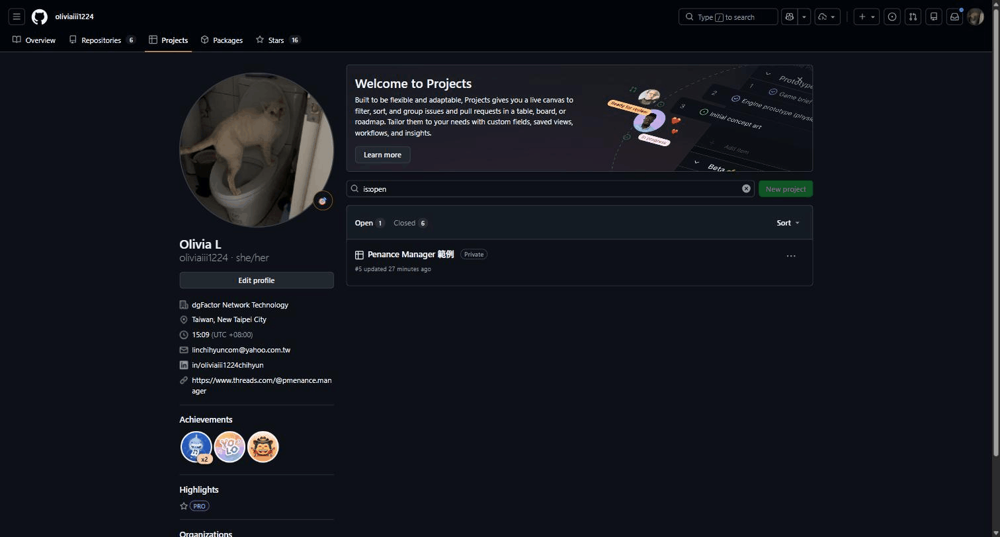
*個人頁的 Projects 分頁,右側綠色按鈕即是 New project*

- 可從**空白範本**或**內建範本**(Team planning、Feature release、Kanban、Roadmap 等)開始,範本會預先帶好一組欄位與 view。

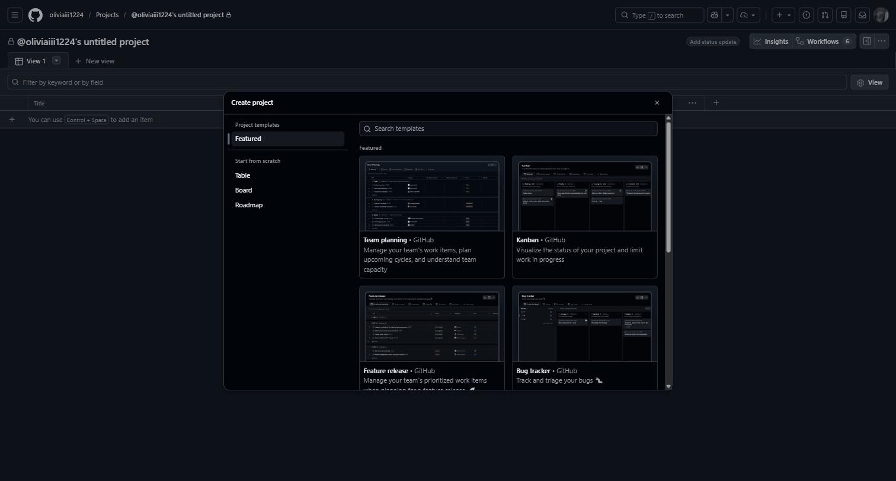
*Create project 視窗:左側可從空白的 Table / Board / Roadmap 開始,右側是內建範本*

- 選「Start from scratch」的版面後,輸入 **Project name**;勾選 **Import items from repository** 可在建立的同時把某個 repo 的 open issues 全部匯入(下方會預告將加入幾個項目),按 **Create project** 完成。

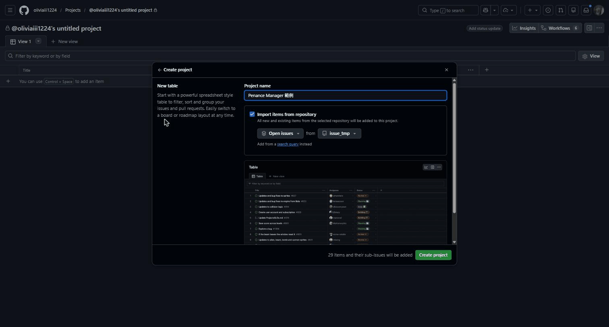
*建立時勾選 Import items from repository,從 issue_tmp 匯入全部 open issues*

### 2. 把項目加進來

加入項目有好幾種方式,挑順手的用:

- **從 Project 內新增** —— 在 table / board 底部的 **+ Add item**,可直接輸入文字建立 draft。
- **貼上網址** —— 在 + Add item 輸入框貼 issue / PR 的完整 URL,即可拉進來。
- **搜尋既有 issue/PR** —— 在 + Add item 輸入 `#` 觸發搜尋,先選 repo 再挑選(或關鍵字搜尋)要加入的 issue / PR。

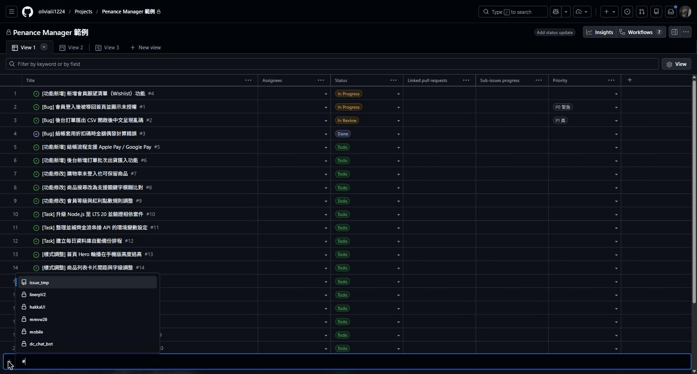
*在 + Add item 輸入 `#` 後會列出可選的 repo,選定後即可搜尋該 repo 的 issue/PR*

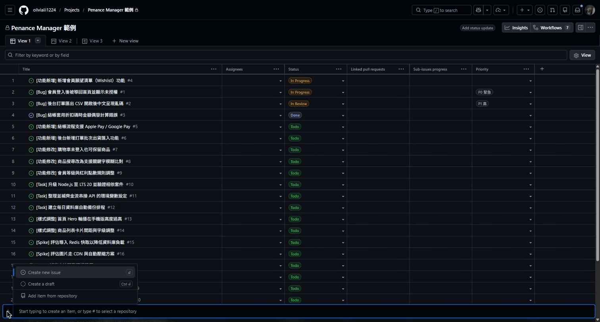
*直接輸入文字則出現三個選項:Create new issue、Create a draft(Ctrl+⏎)、Add item from repository*
- **從 issue/PR 側欄** —— 打開某個 issue/PR,右側欄 **Projects** → 選擇要加入的 Project。
- **自動化加入** —— 用內建的 **Auto-add** 工作流,或 GitHub Actions(見下一節)。

---

## 八、自動化(Automation)

Projects 的自動化由淺到深有三層:內建工作流 → GitHub Actions → GraphQL API。

### 1. Built-in workflows(內建工作流)

不用寫程式,在 Project 右上 **Workflows**(或 ⋯ 選單 → Workflows)開關設定即可:

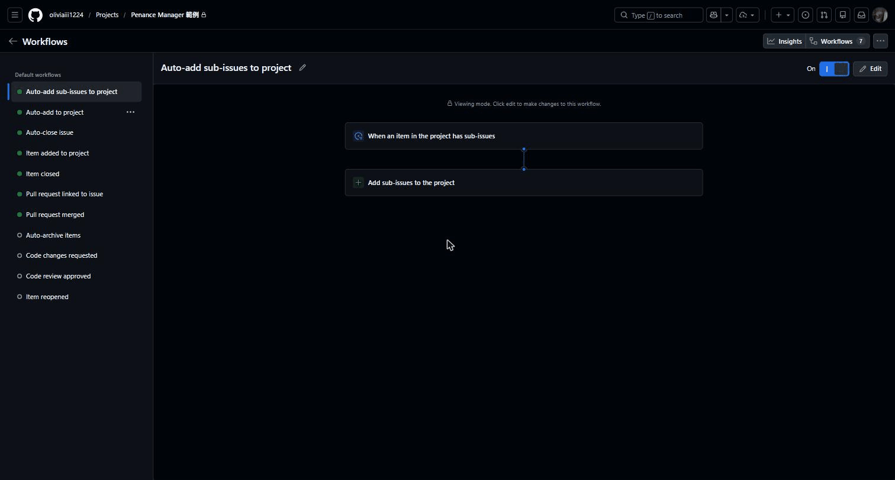
*Workflows 頁面:左側是所有內建工作流,綠點代表已啟用,右上可切換 On/Off 或 Edit*

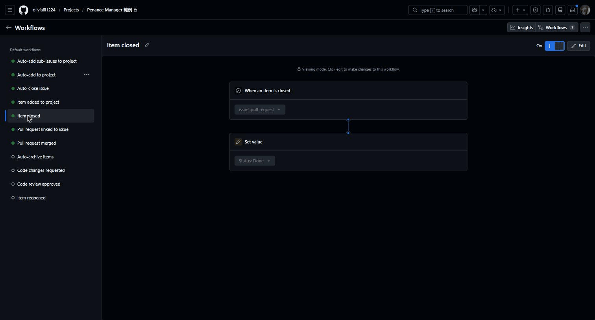
*「Item closed」工作流:當 issue/PR 關閉時,自動把 Status 設為 Done*

常用的有:

| 工作流 | 作用 |
| :--- | :--- |
| **Item added to project** | 項目加入時自動設定欄位(如 Status → Todo) |
| **Item closed** | issue/PR 關閉時設定欄位(如 → Done) |
| **Pull request merged** | PR 合併時設定(如 → Done) |
| **Item reopened** | 重新開啟時設定狀態 |
| **Code changes requested / approved** | 依審查結果設定狀態 |
| **Auto-add to project** | 符合篩選條件的 repo 項目自動加進 Project |
| **Auto-archive items** | 符合條件的項目自動封存 |

> ⚙️ Project 剛建立時,預設就啟用兩個工作流:
> 1. issue/PR 關閉 → Status 設為 **Done**
> 2. PR 合併 → Status 設為 **Done**

### 2. GitHub Actions

需要更進階的邏輯時,用 workflow 檔。GitHub 官方維護的 [`actions/add-to-project`](https://github.com/actions/add-to-project) 可把當前 issue/PR 自動加進 Project:

```yaml
# .github/workflows/add-to-project.yml
name: Add issues to project
on:
  issues:
    types: [opened]
jobs:
  add-to-project:
    runs-on: ubuntu-latest
    steps:
      - uses: actions/add-to-project@v1
        with:
          project-url: https://github.com/orgs/<org>/projects/<number>
          github-token: ${{ secrets.ADD_TO_PROJECT_PAT }}
```

> ⚠️ 一個 Project 可跨多個 repo,但一份 Actions workflow **綁定單一 repo**,所以需要每個 repo 各放一份。

### 3. GraphQL API(ProjectsV2 API)

自由度最高,可程式化讀寫 Project 的項目與欄位值,搭配 webhook 事件做整合。注意 Projects v2 **只有 GraphQL API**,沒有 REST 端點。

---

## 九、Insights(圖表洞察)

在 Project 右上角進入 **Insights**,用 Project 的項目當資料來源畫圖表。

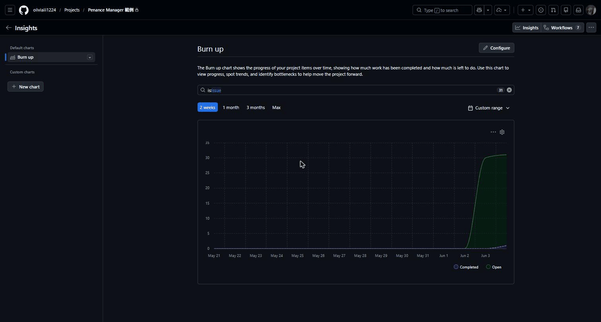
*預設的 Burn up 圖:綠線是 Open、紫線是 Completed,可調整時間範圍與篩選*

### 兩類圖表

- **Current charts(當前)** —— 呈現目前狀態,例如各人負責幾項、各疊代有幾個 issue。
- **Historical charts(歷史)** —— X 軸設為「Time」,呈現隨時間變化;預設的 **Burn up** 圖可看完成與剩餘工作的趨勢。

### 圖表設定

- **圖表類型**:長條(bar)、直條(column)、折線(line)、堆疊面積(stacked area)。
- **彙總函數**:sum、count、average、min、max。
- 可設定 **filter、X 軸、Y 軸、分組**。
- 圖表可**持久保存**並用 **URL 分享**,凡能看 Project 的人都看得到。

> ⚠️ Insights **不追蹤**已封存或已刪除的項目。

---

## 十、Project 層級設定

從 Project 右上 **⋯ → Settings** 進入,可改名稱、預設 repo、簡介與 README;改名、Close、Delete、調整可見性都在這裡:

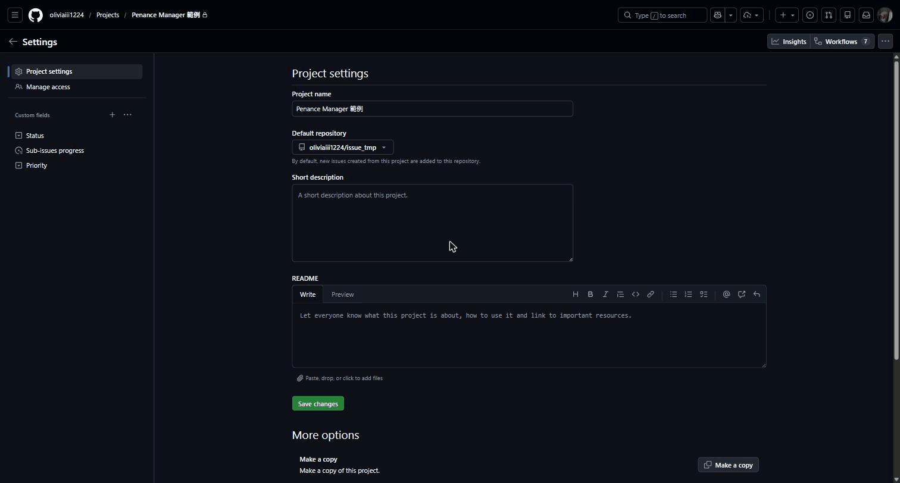
*Project settings:這裡把專案改名為「Penance Manager 範例」;Custom fields 也列在左側*

| 設定 | 說明 |
| :--- | :--- |
| **Visibility(可見性)** | Project 可設為 **public** 或 **private** |
| **Templates(範本)** | 可把 Project 設為範本供組織內共用。範本包含 views、自訂欄位、草稿項目與欄位、已設定的 workflows(**不含** auto-add 工作流)、insights |
| **連結到 team / repo** | 可把 Project 加到某 team(整個團隊取得協作權限),或加到同擁有者的 repo |
| **Status updates(狀態更新)** | 可在 Project 層級貼進度更新(如 On track / At risk / Off track) |
| **Archive(封存)** | 項目可封存而非刪除,保留資料但移出作用中視圖,之後可再還原 |

---

## 十一、權限與協作

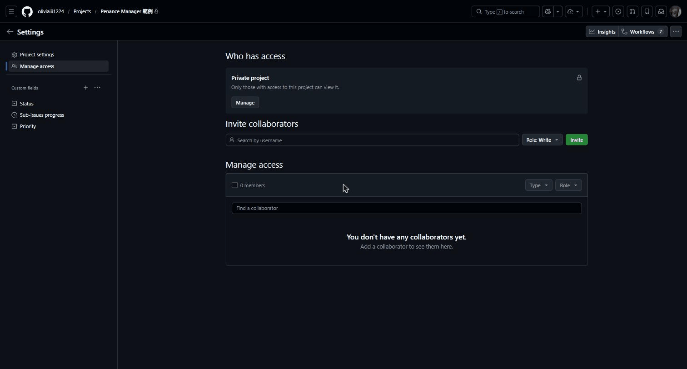
*Settings → Manage access:邀請協作者並指派 Read / Write / Admin 角色*

- **個人 Project**:擁有者可邀請協作者,並指派 **Read / Write / Admin** 角色。
- **組織 Project**:可設定 **base role**(組織成員的預設權限,如 no access / read / write / admin),再針對個別成員或 team 加權限。
- 把 Project **連結到 team**,整個團隊就會取得對應的協作權限,免去逐一邀請。

| 角色 | 可做的事 |
| :--- | :--- |
| **Read** | 檢視 Project 與 view |
| **Write** | 編輯項目、欄位值、建立 view |
| **Admin** | 上述全部 + 管理設定、權限、刪除 Project |

---

## 十二、用 gh CLI 操作 Project

要批次或自動化操作時,GitHub CLI 的 `gh project` 指令很好用。需先安裝 [GitHub CLI](https://cli.github.com/) 並補上 `project` scope:

```bash
# 授權加上 project scope
gh auth refresh -s project,read:project

# 列出某個擁有者(個人或組織)的 Project
gh project list --owner <user-or-org>

# 檢視某個 Project(用 number)
gh project view <number> --owner <owner>

# 建立 Project
gh project create --owner <owner> --title "2026 Q3 Roadmap"

# 把 issue / PR 加進 Project
gh project item-add <number> --owner <owner> --url https://github.com/<owner>/<repo>/issues/123

# 在 Project 內新增 draft item
gh project item-add <number> --owner <owner> --title "調查登入逾時" --body "細節..."

# 列出欄位 / 列出項目
gh project field-list <number> --owner <owner>
gh project item-list  <number> --owner <owner>

# 修改某項目的欄位值(需要 project-id / item-id / field-id,可由上面指令取得)
gh project item-edit --id <item-id> --field-id <field-id> --project-id <project-id> --single-select-option-id <option-id>
```

> 💡 需要更細的程式化操作(如批次改欄位值)時,`gh api graphql` 可直接打 ProjectsV2 GraphQL API。

---

## 十三、實務建議:雙產品線 PM 怎麼用

如果你同時管兩條產品線(例如 CMS / OTT),推薦這套做法:

1. **一個 Project,多個 view**
   與其開兩個 Project,不如用**一個 Project** + 一個 single select 欄位(如 `Product Line: CMS / OTT`)區分,再為每條產品線各建一個套好篩選的 **board view**。資料集中,還能跨線比較。

2. **各自的 sprint 節奏**
   若兩條線疊代週期不同,可開**兩個 iteration 欄位**分別跑,view 各自用 `@current` 過濾,互不干擾。

3. **用 Field sum 看負載**
   加一個 Number 欄位(如 `Effort`),在 board 每欄頂端看加總,快速判斷某狀態 / 某人是否過載。

4. **auto-add 自動化**
   用 **Auto-add** 工作流把「特定 repo + 特定 label」的 issue 自動匯入 Project,省去手動加項目。

5. **Insights 做週報**
   用 **historical burn up** 圖追蹤每條產品線的完成趨勢,把 URL 直接分享給 stakeholder,免截圖。

---

## 十四、常用快捷鍵

記不住沒關係 —— 先記住 `Cmd/Ctrl + K` 開 **command palette**,幾乎所有動作都能用搜尋的方式找到。

| 快捷鍵 | 作用 |
| :--- | :--- |
| `Cmd/Ctrl + K` | 開啟 command palette(打字觸發幾乎所有操作) |
| `c` | 在 view 內建立新項目 |
| `e` | 編輯選取項目 |
| `Space` | 開啟選取項目的詳情 |
| `↑ / ↓ / ← / →` | 在表格 / 看板中移動選取 |
| `Cmd/Ctrl + 點選` | 多選項目以批次編輯 |

---

## 參考資源

- [GitHub Docs — Planning and tracking with Projects](https://docs.github.com/issues/planning-and-tracking-with-projects)
- [GitHub Docs — Projects v2 GraphQL API](https://docs.github.com/issues/planning-and-tracking-with-projects/automating-your-project/using-the-api-to-manage-projects)
- [actions/add-to-project](https://github.com/actions/add-to-project)
